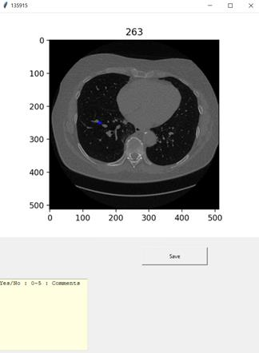

# Interface for blind reading of a nodule from radiologists

> This tool creates a simple Tkinter interface to be used to show the location of a nodule in a particular slice of a participant.
In order for this tool to work we need to have in a folder subfolders with participant ids (so that the title of the image in the interface will be the participant id), each containing some images that include the slice number of the nodule they contain. These images can be created using our semi-automated algorithm which can be found [here](https://github.com/nsourlos/Siemens_AIRadCompanion_automatic_comparison).
User can type in the box that appears comments and by clicking the 'save' button a txt file with them will be created. By clicking the 'x' button the next image will appear in the interface.

The python file that does that can be found [here](/interface.py)

A screenshot of how the interface looks can be seen below

## Documentation (by *Chat GPT*)

The documentation below was created by using the prompt 
> Write documentation for the following code

**Introduction**

The given code provides a GUI based image annotation tool. It takes a folder path as input and loops over the files and subdirectories present in the folder. The tool opens an image and displays it in a full-screen window along with a text prompt. The user can add annotations to the image and save it as a text file.

Library Imports
The following libraries are imported in the code:

`os`: This library is used to interact with the operating system and perform various file-related operations such as walking through directories.
`tkinter`: This library is used to create the GUI of the tool.
`PIL` (Python Imaging Library): This library is used to open and manipulate image files.

**Functionalities**

The code performs the following functionalities:

Take the folder path as input and loop over the files and subdirectories in the folder.
Open an image file and resize it to a specified size.
Display the image in a full-screen window along with a text prompt where the user can add annotations.
Save the annotations as a text file with the same name as the image file.

**Components**

The following components are present in the code:

`Take_input()` function: This function is used to get the annotations from the user and save them as a text file. If a file with the same name already exists, the function saves the file with a unique name by appending an integer to the original file name.

`Tkinter` GUI: The GUI of the tool is created using the tkinter library. The GUI contains an image display panel, a text prompt, a label to display the name of the image file, and a "Save" button to save the annotations as a text file.

**Execution**

To run the code, provide the folder path as input in the data_path variable and run the code. The tool will loop over the files and subdirectories in the folder and display the images one by one in a full-screen window. The user can add annotations to the image and save it as a text file by clicking the "Save" button.

## Contributing
Pull requests are welcome. For major changes, please open an issue first to discuss what you would like to change.

 
## License
[MIT License](LICENSE)
